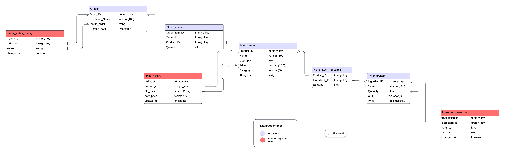

# ☕ Frappuccino Database

## Overview
The **Frappuccino Database** project is a SQL-based relational database designed to enhance the operations of the Frappuccino system. It migrates the JSON-based structure of the hot-coffee project to PostgreSQL, introducing efficient storage, querying, and management of data related to orders, menu items, inventory, and reports.

This project demonstrates the use of advanced SQL features like JSONB, arrays, ENUMs, and full-text search, alongside database schema design and optimized queries.

---

## Features
- 🛒 **Orders Management**: Create, update, retrieve, and manage orders with detailed item tracking.
- 🍴 **Menu Items**: Store and query menu items, customization options, and pricing history.
- 📦 **Inventory System**: Monitor stock levels, ingredients, and transactions.
- 📊 **Reports and Aggregations**: Generate comprehensive sales and inventory reports.
- 🔎 **Full-Text Search**: Query orders, customers, and menu items with advanced filtering.
- ✅ **Data Validation**: Enforced through constraints and triggers.

---

## Project Structure
```
📂 Root
 ├── 📂 internal # Core application logic.
 │   ├── 📂 service # Business logic and services.
 │   ├── 📂 dal # Data Access Layer (Database interactions). 
 │   └── 📂 handler # HTTP handlers for API endpoints. 
 ├── 📂 cmd # Command-line tools for database interaction. 
 ├── 📂 models #  models of structures.
 ├── 📄 Dockerfile #build a container image for the Frappuccino project.
 ├── 📄 docker-compose.yml # Containerization setup.
 ├── 📄 init.sql # SQL scripts for database initialization. 
 ├── 📄 insert.sql # adds test data.
```

---

## Database Schema
### Entity-Relationship Diagram


The schema includes the following tables:
1. **Orders**: Tracks order details, statuses, and totals.
2. **Order_Items**: Links orders to menu items, tracking quantity and customization.
3. **Menu_Items**: Contains product information and ingredient links.
4. **Inventory**: Manages ingredient stock levels and transactions.
5. **Menu_Item_Ingredients**: Junction table for recipes and inventory integration.
6. **Order_Status_History**: Tracks state transitions of orders.
7. **Price_History**: Logs changes in menu item prices.
8. **Inventory_Transactions**: Records ingredient usage and adjustments.

---
## Setup Instructions
1. Clone the repository:
   ```bash
   git clone https://github.com/eraga0423/coffee-shop-2.0
   ```
2. Create file .env

3. Set up the database using Docker
    ```bash
    docker-compose up
    ```
    
## API Endpoints

### Orders
- **POST** `/orders`: Create a new order.
- **GET** `/orders`: Retrieve all orders.
- **GET** `/orders/{id}`: Retrieve a specific order by ID.
- **PUT** `/orders/{id}`: Update an order.
- **DELETE** `/orders/{id}`: Delete an order.

### Menu Items
- **POST** `/menu`: Add a menu item.
- **GET** `/menu`: Retrieve all menu items.
- **GET** `/menu/{id}`: Retrieve a specific menu item.
- **PUT** `/menu/{id}`: Update a menu item.
- **DELETE** `/menu/{id}`: Delete a menu item.

### Inventory
- **POST** `/inventory`: Add an inventory item.
- **GET** `/inventory`: Retrieve all inventory items.
- **GET** `/inventory/{id}`: Retrieve a specific inventory item.
- **PUT** `/inventory/{id}`: Update an inventory item.
- **DELETE** `/inventory/{id}`: Delete an inventory item.

